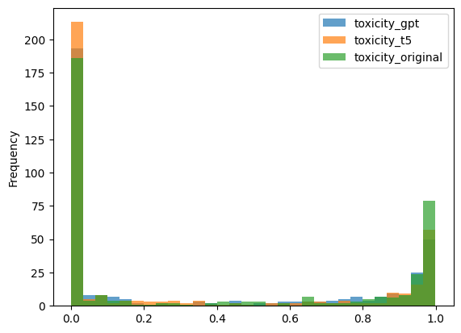
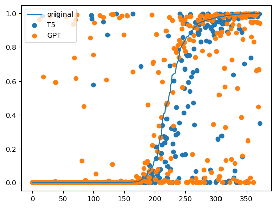
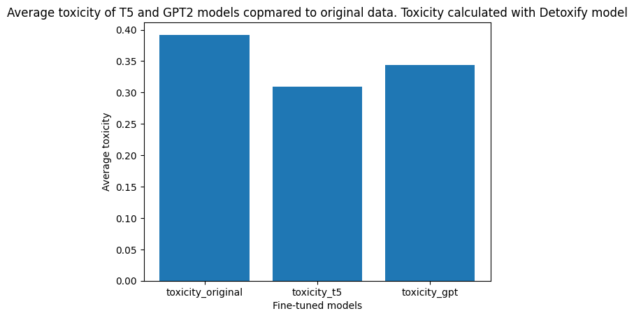

# The final report

## Solution

I ended up with two trained models: GPT2 and T5. I could not decide which one to pick as the final one, so I included notebooks and checkpoints for both.

The Python scripts in `./src` use GPT2, because it is more lightweight.

GPT2 is a decoder-only model, so during training it only accepts inputs - no expected outputs. That's the main power of GPT model family: it can consume enormous amounts of raw data, without data labelling.

But since this assignment actually requires to use expected outputs, I came up with a clever trick: I format the text in the following way:

```
User: <original text>
Assistant: <detoxified text>
```

Since the main purpose of GPT is to predict the next token, naturally, when it receives a `User: <text>` input, it goes on with `Assistant: <detoxified text>`.

One epoch of training took around 90-100 minutes. I did one epoch, then tested the output, it was OK, then I started another two epochs.


## Some words on T5

T5, contrary to GPT, is traditional encoder-decoder model, which requires it to get both input and expected output, which fits the provided dataset (and task) just right without any tricks.

I suppose T5 is slower because model creators had to choose bigger weight count, given that the original intent is to make model multi-task with large amount of different tasks.

One epoch of training took 7-8 hours. I only did one epoch, because results were good enough and I was tired of wasting so much time when GPT took only the fraction of this.


## Hardware used

Work was done using a huge variety of software. Some part was done locally on my laptop with Linux (with no acceleration, CPU-only), some on M1 MacBook (with MPS device for training/inference acceleration), some on desktop PC with RTX2060, some on Kaggle with 2 x Tesla T4, some on Google Colab with 1 x Tesla T4, and the final models were trained on Selectel VDS (Virtual Dedicated Server) with Tesla A4000.

When I trained GPT2, I fit VRAM PERFECTLY: I had 31MB free out of 16GB :) It would be a shame if some random allocation would end up failing the training process...

I tested inference on CPU and it works OK (not very fast, but still, I could manage to compute some metrics).

# Evaluation

Both the GPT-2 and T5 models exhibit impressive learning capabilities, achieving excellent performance after just one epoch.

To present the results, let's establish an evaluation technique. Recent research has emphasized the need to replace traditional evaluation metrics used for NLP models with more comprehensive approaches that involve tasks like classification, similarity evaluation, and others specifically designed for transformer training. In accordance with this, I have opted to utilize the high-performing toxification classifier model provided by https://github.com/unitaryai/detoxify. This model will assist in evaluating the performance of both GPT-2 and T5.

Naturally, I did not conduct the detoxification evaluation based on the training dataset, so I decided to use the one from https://www.kaggle.com/c/jigsaw-toxic-comment-classification-challenge. I predicted detoxified versions using both models and assessed the toxicity using Detoxify.

# Results






The GPT model had a higher toxic prediction rate than the original text in 56.0% of cases. The T5 model had a higher toxic prediction rate than the original text in 28.666666666666668% of cases.

When I measured the performance for 200 samples, the results improved (30% and 14% respectively). The dataset used for evaluation contained a greater number of special symbols and languages compared to the initial dataset. Therefore, it is crucial to expand the evaluation sampling and utilize other datasets.


# Problems

There was an issue with Detoxify as it required an older version of "transformers" than my models. Consequently, the predictions and evaluations were separated into two notebooks: 3.0 and 2.2.

